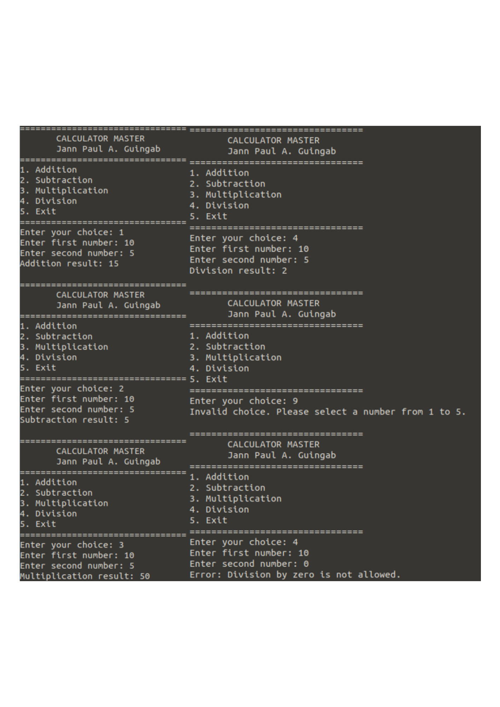

# Calculator Master

## Student Name
Jann Paul A. Guingab

## Course and Section
ITNT415 - BIT41

## Project Description
Calculator Master is a menu-driven Python calculator developed using Git and GitHub. The project demonstrates Python programming, Git branching, source code management, Pull Requests, and merge operations.

## Branch Structure

- main
- addition_Guingab
- subtraction_Guingab
- multiplication_Guingab
- division_Guingab

## Program Features

- Addition
- Subtraction
- Multiplication
- Division
- Menu-driven interface
- User input validation
- Invalid input handling
- Division-by-zero handling
- Continuous execution until the user exits

## Sample Execution Screenshot

